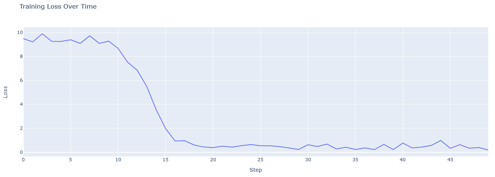

# Отчет о выполнении задания №2 ("Разработка генеративного чат-бота"). Выполнил Константин Мавропуло.

## ***Содержание отчета***
1. Описание входных данных ([_ссылка_](#1-описание-входных-данных)).
2. Описание артефактов (выходных файлов) ([_ссылка_](#2-описание-артефактов)).
3. Указание структуры проекта (включая файлы, доступные в GitHub и по ссылкам) ([_ссылка_](#3-описание-структуры-проекта)).
4. График обучения и валидации модели, с комментариями ([_ссылка_](#4-график-обучения-GPT2-модели)).
5. Инструкция по запуску ([_ссылка_](#5-инструкция-по-запуску)).
6. Описание использования модели (классы, методы, ресурсы реализующие логику выдачи ответов)([_ссылка_](#6-описание-использования-модели)).
7. Ускорение вывода, а также итеративный процесс улучшений проекта (опыт, выводы, подходы и методы)([_ссылка_](#7-ускорение-и-итеративные-улучшения)).

---

## 1 описание входных данных:
- в качестве входных данных используются диалоги из сериала "The Simpsons";
- можно разделить входные данные на 2 блока: сырые до предобработки в исходном виде, и также данные после обработки.
### 1.1 Описание исходных данных:
- файл по пути *ml/data/raw/script_lines.csv*;
- столбцы - id, episode_id, number, raw_text, timestamp_in_ms, speaking_line, character_id, location_id, raw_character_text, raw_location_text, spoken_words, normalized_text, word_count;
- кол-во записей - 158267;
- каждая запись содержит данные полей указанных выше для реплики из сериала;
- распределение реплик по персонажам представлено на диаграмме ниже:

- в четверку лидеров входит **Lisa Simpson, именно этот персонаж выбран в качестве роли для чат-бота**;
- наиболее информативным полем является поле raw_text с именем персонажа и репликой, для кросс-проверки данных также использовались другие поля (например, character_id).
### 1.2 Описание предобработанных данных:
- **ml/data/processed** - получены предобработанные файлы:
  - qa_pairs.joblib (данные реплик обогащены тремя предыдущими, сохранена текущая реплика, а также метка принадлежности к целевому персонажу Lisa Simpson);
  - target_char_answers.joblib (аналогично target_char_qa_pairs.joblib, но лишь ответы);
  - target_char_qa_pairs.joblib (аналогично qa_pairs.joblib, но отфильтрованы ответы целевого персонажа, поле контекста сохранено);
- несколько нюансов про предобработку данных - в пункте 7 ("итеративный процесс улучшений");
- по итогам предобработки реплики были обогащены контекстом (предыдущими репликами), причем группировка производилась по эпизоду и локации (например, автомобиль, магазин);
- запуск предобработки производился в ноутбуке (это единственный случай в этом проекте, когда не выделялись классы и модули py, хотя подкачивался файл с постоянными полями).
## 2-описание-артефактов:
- модель по итогам обучения - ссылки представлены в файле *ml/asset/model/models_links.info*, ниже снимок файлов модели в хранилище;

- токенизатор (GPT2Tokenizer.from_pretrained('gpt2')) по пути *ml/asset/tokenizer/tokenizer.joblib* - для повторяемости вывода.
## 3-описание-структуры-проекта:
- проект состоит из трех основных блоков - ML файлы, файлы Web-приложения, прочие файлы;
- в целом структура проекта отображена на снимке ниже.

### 3.1 ML файлы проекта:
- **assets** (артефакты выхода после процессинга), см. пункт 2 выше;
- **notebook** (ноутбуки для подкачки исходных кодов из github репозитория проекта и запуска предобработки, тренировки, валидации, тестов и старта приложения:
  - *ml/notebook/features_preprocessing_notebook.ipynb* (ноутбук предобработки данных);
  - *ml/notebook/gpt_fine_tuning_pipeline_runner_notebook.ipynb* (ноутбук скачивания ML кода данного проекта с GitHub и запуска fine-tuning gpt модели, генерации артефактов);  
  - *ml/notebook/web_app_tests_and_starter_notebook.ipynb* (ноутбук скачивания кода Web-приложения данного проекта с GitHub, запуска интеграционного тестирования, а также старта приложения);
- **src/train** (исходные файлы с модулями, содержащими классы):
  - *ml/src/train/gpt2_fine_tuning_pipeline_module.py* - модуль реализация класса с шагами fine-tuning GPT2 модели, реализации Dataset и класса для сохранения метрики обучения MetricsCallback;
  - *ml/src/train/models_zoo_module.py* - модуль с архитектурой модели;
- **data** - см. пункт 1.2.
### 3.2 Файлы Web-приложения:
- **web_app/src** - модули реализующие трехуровневую архитектуру с вспомогательной логикой:
  - *chat_controller_module.py* (Диспетчер-Контроллер);
  - *chat_repository_module.py* (сервис с основной логикой выдачи ответов);
  - *chat_service_module.py* (репозиторий, хранящий состояние чата и модели, для расширяемости);
  - *chat_util_module* и *constants_module* (классы содержащие вспомогательную логику для логирования, а также постоянные поля, используются также и ML исходниками);
  - *run_web_app_script* (модуль со скриптом инициализации всего приложения, поддерживает реальный старт всего приложения, а также загрузку для интеграционного тестирования);
- **web_app/test** - модуль с 12 интеграционными тестами (запускается из notebook описанного в пункте 3.1).
### 3.3 Прочие файлы:
- *README.md* - файл отчета о выполнении задания;
- прочие файлы, картинки для данного отчета, gitignore и т.д.
## 4 График обучения GPT2 модели:
- среди всех попыток выведен лучший график fine-tuning (только GPT2 модели, все прочие модели, включая первое задание - удалены);
- важные комментарии ко всем графиками ниже:
  - 1 эпоха;
  - на графике отображаются Train Loss per log step;
  - результат сходится, нет зигзагов, нет переобучения;
  - заметен так называемый локоть на графике, явного недообучения также нет.
  
## 5 Инструкция по запуску:
- функциональность и ссылки даны в пункте 3.1, ключевая функциональность запускается из *ml/notebook/web_app_tests_and_starter_notebook.ipynb* (2 режима: вопрос-ответ, диалог);
- в самих ноутбуках (в дополнение к предобработке данных и коду для сборки, запуска обучения, тестов и приложения) есть график, таблицы, логи тестов и старта приложения и тестами.
## 6 Описание использования модели:
- модель GPT2 обучена (fine-tuning) путем использования контекста из 3 предыдущих вопросов и ответа персонажа;
- пользователь может вести диалог с моделью в 2 режимах - вопрос-ответ (без сохранения других ответов), а также в режиме диалога (см. пример использования в notebook web_app_tests_and_starter_notebook).
## 7 Ускорение и итеративные улучшения:
- на первом шаге было выяснено то, что модель потребляет много ресурсов, поэтому был уменьшен размер batch и понижена точность;
- вывод модели работает быстрее, чем кешированные ранее Bi-Encoder и Cross-Encoder;
- эмбеддинги не используются, что уменьшило использование файловой системы и чуть ускоряет загрузку;
- результат выглядит более расширяемым и ответы более гибкие по широкому спектру топиков;
- для тестирования выполнения задачи (покрытия основных функциональностей) создано 3 интеграционных теста (детали запуска в web_app_tests_and_starter_notebook), ниже результат выполнения:

- примеры общения в режиме вопрос-ответ и диалога - представлены в web_app_tests_and_starter_notebook, один приведен ниже:

